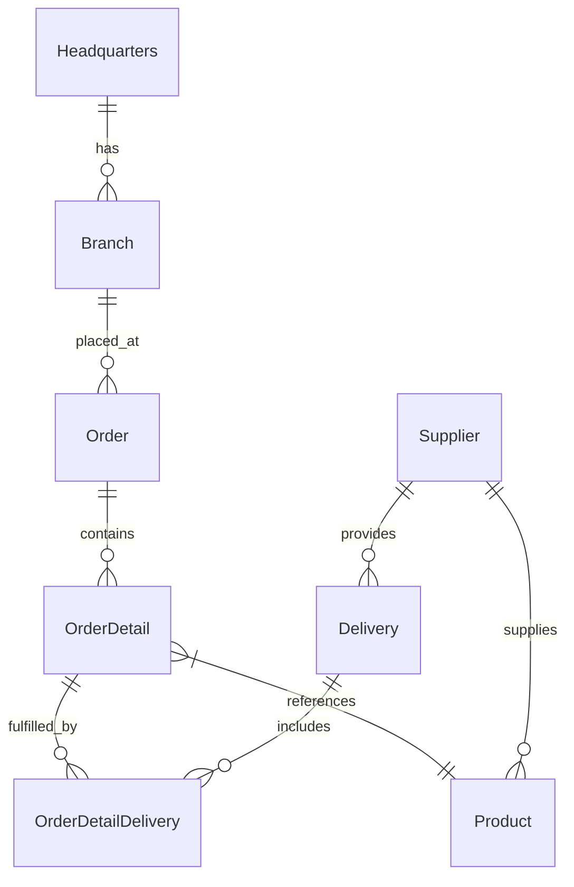

# Database Documentation

This document provides comprehensive information about the SQLite database schema, migrations, and seed data for the OctoCAT Supply Chain Management API.

## Overview

The API uses SQLite as its persistence layer with the following characteristics:
- **File-based storage**: `api/data/app.db` (configurable via `DB_FILE` environment variable)
- **WAL mode**: Enabled by default for better concurrency
- **Foreign keys**: Enforced to maintain referential integrity
- **Test mode**: In-memory database (`:memory:`) for fast, isolated tests

## Database Schema

The database follows the Entity Relationship Diagram (ERD) at `api/ERD.png`.

### Schema Diagram



## Tables

### suppliers

Stores supplier/vendor information.

| Column | Type | Constraints | Description |
|--------|------|-------------|-------------|
| `supplier_id` | INTEGER | PRIMARY KEY | Unique identifier |
| `name` | TEXT | NOT NULL | Supplier company name |
| `description` | TEXT | | Company description |
| `contact_person` | TEXT | | Primary contact name |
| `email` | TEXT | | Contact email address |
| `phone` | TEXT | | Contact phone number |

**Relationships:**
- One-to-many with `products`
- One-to-many with `deliveries`

### headquarters

Stores company headquarters information.

| Column | Type | Constraints | Description |
|--------|------|-------------|-------------|
| `headquarters_id` | INTEGER | PRIMARY KEY | Unique identifier |
| `name` | TEXT | NOT NULL | Headquarters name |
| `description` | TEXT | | Description |
| `address` | TEXT | | Physical address |
| `contact_person` | TEXT | | Primary contact name |
| `email` | TEXT | | Contact email address |
| `phone` | TEXT | | Contact phone number |

**Relationships:**
- One-to-many with `branches`

### branches

Stores branch location information.

| Column | Type | Constraints | Description |
|--------|------|-------------|-------------|
| `branch_id` | INTEGER | PRIMARY KEY | Unique identifier |
| `headquarters_id` | INTEGER | NOT NULL, FK | Reference to headquarters |
| `name` | TEXT | NOT NULL | Branch name |
| `description` | TEXT | | Description |
| `address` | TEXT | | Physical address |
| `contact_person` | TEXT | | Primary contact name |
| `email` | TEXT | | Contact email address |
| `phone` | TEXT | | Contact phone number |

**Relationships:**
- Many-to-one with `headquarters`
- One-to-many with `orders`

**Foreign Keys:**
- `headquarters_id` → `headquarters(headquarters_id)` ON DELETE CASCADE

**Indexes:**
- `idx_branches_headquarters_id` on `headquarters_id`

### products

Stores product catalog information.

| Column | Type | Constraints | Description |
|--------|------|-------------|-------------|
| `product_id` | INTEGER | PRIMARY KEY | Unique identifier |
| `supplier_id` | INTEGER | NOT NULL, FK | Reference to supplier |
| `name` | TEXT | NOT NULL | Product name |
| `description` | TEXT | | Product description |
| `price` | REAL | NOT NULL | Current price |
| `sku` | TEXT | NOT NULL | Stock Keeping Unit code |
| `unit` | TEXT | NOT NULL | Unit of measurement (e.g., "box", "pallet") |
| `img_name` | TEXT | | Product image filename |
| `discount` | REAL | DEFAULT 0.0 | Discount percentage (0.0-1.0) |

**Relationships:**
- Many-to-one with `suppliers`
- One-to-many with `order_details`

**Foreign Keys:**
- `supplier_id` → `suppliers(supplier_id)` ON DELETE CASCADE

**Indexes:**
- `idx_products_supplier_id` on `supplier_id`
- `idx_products_sku` on `sku`

### orders

Stores customer order information.

| Column | Type | Constraints | Description |
|--------|------|-------------|-------------|
| `order_id` | INTEGER | PRIMARY KEY | Unique identifier |
| `branch_id` | INTEGER | NOT NULL, FK | Branch that placed the order |
| `order_date` | TEXT | NOT NULL | Order date (ISO 8601 format) |
| `name` | TEXT | NOT NULL | Order name/reference |
| `description` | TEXT | | Order description |
| `status` | TEXT | NOT NULL, DEFAULT 'pending' | Order status (pending, processing, completed, cancelled) |

**Relationships:**
- Many-to-one with `branches`
- One-to-many with `order_details`

**Foreign Keys:**
- `branch_id` → `branches(branch_id)` ON DELETE CASCADE

**Indexes:**
- `idx_orders_branch_id` on `branch_id`
- `idx_orders_status` on `status`

### order_details

Stores individual line items for orders.

| Column | Type | Constraints | Description |
|--------|------|-------------|-------------|
| `order_detail_id` | INTEGER | PRIMARY KEY | Unique identifier |
| `order_id` | INTEGER | NOT NULL, FK | Reference to order |
| `product_id` | INTEGER | NOT NULL, FK | Reference to product |
| `quantity` | INTEGER | NOT NULL | Quantity ordered |
| `unit_price` | REAL | NOT NULL | Price per unit at time of order |
| `notes` | TEXT | | Additional notes |

**Relationships:**
- Many-to-one with `orders`
- Many-to-one with `products`
- One-to-many with `order_detail_deliveries`

**Foreign Keys:**
- `order_id` → `orders(order_id)` ON DELETE CASCADE
- `product_id` → `products(product_id)` ON DELETE CASCADE

**Indexes:**
- `idx_order_details_order_id` on `order_id`
- `idx_order_details_product_id` on `product_id`

### deliveries

Stores delivery information from suppliers.

| Column | Type | Constraints | Description |
|--------|------|-------------|-------------|
| `delivery_id` | INTEGER | PRIMARY KEY | Unique identifier |
| `supplier_id` | INTEGER | NOT NULL, FK | Supplier making the delivery |
| `delivery_date` | TEXT | NOT NULL | Delivery date (ISO 8601 format) |
| `name` | TEXT | NOT NULL | Delivery name/reference |
| `description` | TEXT | | Delivery description |
| `status` | TEXT | NOT NULL, DEFAULT 'pending' | Delivery status (pending, in_transit, delivered, cancelled) |

**Relationships:**
- Many-to-one with `suppliers`
- One-to-many with `order_detail_deliveries`

**Foreign Keys:**
- `supplier_id` → `suppliers(supplier_id)` ON DELETE CASCADE

**Indexes:**
- `idx_deliveries_supplier_id` on `supplier_id`
- `idx_deliveries_status` on `status`

### order_detail_deliveries

Junction table linking order details to deliveries.

| Column | Type | Constraints | Description |
|--------|------|-------------|-------------|
| `order_detail_delivery_id` | INTEGER | PRIMARY KEY | Unique identifier |
| `order_detail_id` | INTEGER | NOT NULL, FK | Reference to order detail |
| `delivery_id` | INTEGER | NOT NULL, FK | Reference to delivery |
| `quantity` | INTEGER | NOT NULL | Quantity fulfilled by this delivery |
| `notes` | TEXT | | Additional notes |

**Relationships:**
- Many-to-one with `order_details`
- Many-to-one with `deliveries`

**Foreign Keys:**
- `order_detail_id` → `order_details(order_detail_id)` ON DELETE CASCADE
- `delivery_id` → `deliveries(delivery_id)` ON DELETE CASCADE

**Indexes:**
- `idx_order_detail_deliveries_order_detail_id` on `order_detail_id`
- `idx_order_detail_deliveries_delivery_id` on `delivery_id`

## Migrations System

Database schema changes are managed through SQL migration files in `api/sql/migrations/`.

### Migration Files

Migrations are executed in sequential order based on filename:
- `001_init.sql` - Initial schema creation

### Migration Tracking

The system maintains a `migrations` table to track which migrations have been executed:

```sql
CREATE TABLE migrations (
    id INTEGER PRIMARY KEY,
    name TEXT NOT NULL UNIQUE,
    executed_at TEXT NOT NULL
);
```

### Running Migrations

```bash
# Run all pending migrations
npm run db:migrate --workspace=api

# Or initialize database with migrations + seed data
npm run db:init --workspace=api
```

### Creating New Migrations

To add a new migration:

1. Create a new file: `api/sql/migrations/00X_description.sql`
2. Add your SQL statements
3. Run migrations to apply changes

**Important Rules:**
- Never modify existing migration files
- Always increment the migration number
- Test migrations on a copy of the database first
- Ensure migrations are idempotent when possible (use `IF NOT EXISTS` clauses)

## Seed Data

Sample data is provided through SQL files in `api/sql/seed/` for demo and testing purposes.

### Seed Files

Executed in order:
1. `001_suppliers.sql` - Sample supplier data
2. `002_headquarters.sql` - Sample headquarters data
3. `003_branches.sql` - Sample branch data
4. `004_products.sql` - Sample product catalog
5. `005_orders.sql` - Sample orders
6. `006_order_details.sql` - Sample order line items
7. `007_deliveries.sql` - Sample delivery data
8. `008_order_detail_deliveries.sql` - Sample delivery fulfillments

### Running Seed Data

```bash
# Seed the database
npm run db:seed --workspace=api

# Or initialize with migrations + seed
npm run db:init --workspace=api
```

### Seed Data Characteristics

- **Deterministic**: Produces consistent data each run
- **Referential Integrity**: Maintains proper foreign key relationships
- **Realistic**: Provides meaningful demo data
- **Resettable**: Can be cleared and re-seeded for testing

## Database Configuration

Configuration is managed in `api/src/db/config.ts`:

```typescript
export const DB_CONFIG = {
    DB_FILE: process.env.DB_FILE || './data/app.db',
    DB_ENGINE: process.env.DB_ENGINE || 'sqlite',
    ENABLE_WAL: process.env.DB_ENABLE_WAL !== 'false',
    TIMEOUT: parseInt(process.env.DB_TIMEOUT || '30000'),
    FOREIGN_KEYS: process.env.DB_FOREIGN_KEYS !== 'false'
};
```

### Configuration Options

- **DB_FILE**: Database file path (absolute or relative to `api/`)
- **DB_ENGINE**: Database engine (currently only `sqlite`)
- **ENABLE_WAL**: Enable Write-Ahead Logging for better concurrency
- **TIMEOUT**: Connection timeout in milliseconds
- **FOREIGN_KEYS**: Enable foreign key constraint enforcement

## Performance Optimizations

### Indexes

Indexes are created on:
- All foreign key columns for faster JOIN operations
- Frequently queried columns (`status`, `sku`)
- Composite indexes for common query patterns

### WAL Mode

Write-Ahead Logging (WAL) mode is enabled by default, providing:
- Better concurrency (readers don't block writers)
- Faster write performance
- More robust crash recovery

### Query Optimization

- **Parameterized queries**: Allows query plan caching
- **Selective columns**: Repositories only select needed columns
- **Efficient JOINs**: Indexes support optimal JOIN execution

## Backup and Recovery

### Manual Backup

```bash
# Backup the database file
cp api/data/app.db api/data/app-backup-$(date +%Y%m%d-%H%M%S).db
```

### Restore from Backup

```bash
# Restore from a backup
cp api/data/app-backup-YYYYMMDD-HHMMSS.db api/data/app.db
```

### Automated Backups

For production deployments, implement automated backup strategies:
- Regular scheduled backups
- Off-site storage
- Backup verification

## Testing Strategy

### Test Database

Tests use an in-memory SQLite database (`:memory:`) for:
- **Speed**: No disk I/O overhead
- **Isolation**: Each test suite gets a fresh database
- **Cleanup**: Database is destroyed after tests complete

### Test Database Setup

```typescript
import { getDatabase } from '../db/sqlite';

// Create in-memory database for testing
const db = await getDatabase(true); // true = test mode
```

## Troubleshooting

### Database Locked Error

**Symptoms**: `SQLITE_BUSY: database is locked` errors

**Causes**:
- Long-running transactions
- Unclosed database connections
- Concurrent writes without WAL mode

**Solutions**:
1. Ensure all database operations are properly awaited
2. Enable WAL mode (default)
3. Increase timeout setting
4. Check for unclosed connections in error handlers

### Foreign Key Constraint Violations

**Symptoms**: `FOREIGN KEY constraint failed` errors

**Causes**:
- Attempting to insert records that reference non-existent parent records
- Deleting parent records without handling dependent records

**Solutions**:
1. Verify referenced entities exist before creating relationships
2. Use CASCADE delete when appropriate
3. Check the order of data insertion in seed files

### Migration Errors

**Symptoms**: Migration fails to execute

**Causes**:
- SQL syntax errors
- Schema conflicts with existing structure
- Missing migration dependencies

**Solutions**:
1. Test migration SQL manually using SQLite CLI
2. Verify migration order and dependencies
3. Check for conflicting column/table names
4. Review migration tracking table for execution history

## Best Practices

1. **Never modify existing migrations** - Always create new migration files
2. **Use transactions** for multi-statement migrations
3. **Test seed data order** - Ensure foreign key relationships are satisfied
4. **Keep seeds minimal** - Only include data needed for demos/testing
5. **Document schema changes** - Add comments to complex migrations
6. **Verify data integrity** - Run checks after seeding
7. **Use indexes wisely** - Balance query performance with write overhead
8. **Monitor database size** - SQLite files can grow indefinitely

## Additional Resources

- [SQLite Documentation](https://www.sqlite.org/docs.html)
- [SQLite WAL Mode](https://www.sqlite.org/wal.html)
- [Repository Pattern](./repository-pattern.md)
- [Development Guide](./development.md)
