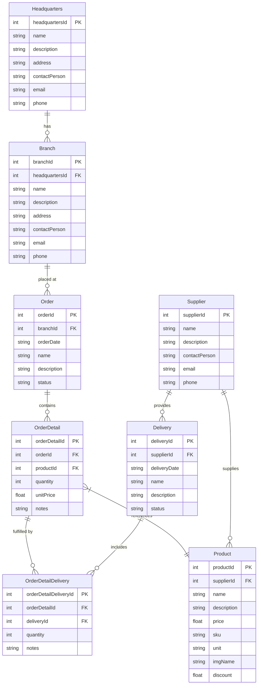

# Models Documentation

This document describes all TypeScript entity models used in the OctoCAT Supply Chain Management API. These models represent the domain entities and their relationships.

## Overview

Models are TypeScript interfaces that define the structure of data entities. They:
- Define type-safe data structures for the application
- Use **camelCase** naming convention (e.g., `productId`)
- Map to database tables that use **snake_case** (e.g., `product_id`)
- Include JSDoc comments with Swagger/OpenAPI annotations
- Are located in `api/src/models/`

## Model Naming Conventions

- **Interface Names**: Singular, PascalCase (e.g., `Product`, `Order`)
- **Field Names**: camelCase (e.g., `supplierId`, `orderDate`)
- **Primary Keys**: `{entityName}Id` (e.g., `productId`, `orderId`)
- **Foreign Keys**: `{referencedEntity}Id` (e.g., `supplierId`, `branchId`)

## Models

### Supplier

Represents a supplier or vendor that provides products.

**File**: `api/src/models/supplier.ts`

```typescript
export interface Supplier {
  supplierId: number;
  name: string;
  description: string;
  contactPerson: string;
  email: string;
  phone: string;
}
```

| Field | Type | Required | Description |
|-------|------|----------|-------------|
| `supplierId` | number | Yes | Unique identifier |
| `name` | string | Yes | Supplier company name |
| `description` | string | No | Company description |
| `contactPerson` | string | No | Primary contact name |
| `email` | string | No | Contact email address |
| `phone` | string | No | Contact phone number |

**Relationships:**
- One-to-many with `Product` (a supplier can provide multiple products)
- One-to-many with `Delivery` (a supplier can make multiple deliveries)

**Database Table**: `suppliers`

---

### Headquarters

Represents company headquarters.

**File**: `api/src/models/headquarters.ts`

```typescript
export interface Headquarters {
  headquartersId: number;
  name: string;
  description: string;
  address: string;
  contactPerson: string;
  email: string;
  phone: string;
}
```

| Field | Type | Required | Description |
|-------|------|----------|-------------|
| `headquartersId` | number | Yes | Unique identifier |
| `name` | string | Yes | Headquarters name |
| `description` | string | No | Description |
| `address` | string | No | Physical address |
| `contactPerson` | string | No | Primary contact name |
| `email` | string | No | Contact email address |
| `phone` | string | No | Contact phone number |

**Relationships:**
- One-to-many with `Branch` (headquarters can have multiple branches)

**Database Table**: `headquarters`

---

### Branch

Represents a branch location linked to headquarters.

**File**: `api/src/models/branch.ts`

```typescript
export interface Branch {
  branchId: number;
  headquartersId: number;
  name: string;
  description: string;
  address: string;
  contactPerson: string;
  email: string;
  phone: string;
}
```

| Field | Type | Required | Description |
|-------|------|----------|-------------|
| `branchId` | number | Yes | Unique identifier |
| `headquartersId` | number | Yes | Reference to headquarters |
| `name` | string | Yes | Branch name |
| `description` | string | No | Description |
| `address` | string | No | Physical address |
| `contactPerson` | string | No | Primary contact name |
| `email` | string | No | Contact email address |
| `phone` | string | No | Contact phone number |

**Relationships:**
- Many-to-one with `Headquarters` (branch belongs to one headquarters)
- One-to-many with `Order` (branch can place multiple orders)

**Database Table**: `branches`

---

### Product

Represents a product in the catalog.

**File**: `api/src/models/product.ts`

```typescript
export interface Product {
  productId: number;
  supplierId: number;
  name: string;
  description: string;
  price: number;
  sku: string;
  unit: string;
  imgName: string;
  discount?: number;
}
```

| Field | Type | Required | Description |
|-------|------|----------|-------------|
| `productId` | number | Yes | Unique identifier |
| `supplierId` | number | Yes | Reference to supplier |
| `name` | string | Yes | Product name |
| `description` | string | No | Product description |
| `price` | number | Yes | Current price |
| `sku` | string | Yes | Stock Keeping Unit code |
| `unit` | string | Yes | Unit of measurement (e.g., "box", "pallet") |
| `imgName` | string | No | Product image filename |
| `discount` | number | No | Discount percentage (0.0-1.0, e.g., 0.25 = 25% off) |

**Relationships:**
- Many-to-one with `Supplier` (product belongs to one supplier)
- One-to-many with `OrderDetail` (product can appear in multiple order details)

**Database Table**: `products`

---

### Order

Represents a customer order placed at a branch.

**File**: `api/src/models/order.ts`

```typescript
export interface Order {
  orderId: number;
  branchId: number;
  orderDate: string;
  name: string;
  description: string;
  status: string;
}
```

| Field | Type | Required | Description |
|-------|------|----------|-------------|
| `orderId` | number | Yes | Unique identifier |
| `branchId` | number | Yes | Branch that placed the order |
| `orderDate` | string | Yes | Order date (ISO 8601 format) |
| `name` | string | Yes | Order name/reference |
| `description` | string | No | Order description |
| `status` | string | Yes | Order status: `pending`, `processing`, `completed`, `cancelled` |

**Relationships:**
- Many-to-one with `Branch` (order belongs to one branch)
- One-to-many with `OrderDetail` (order contains multiple line items)

**Database Table**: `orders`

---

### OrderDetail

Represents a line item in an order.

**File**: `api/src/models/orderDetail.ts`

```typescript
export interface OrderDetail {
  orderDetailId: number;
  orderId: number;
  productId: number;
  quantity: number;
  unitPrice: number;
  notes: string;
}
```

| Field | Type | Required | Description |
|-------|------|----------|-------------|
| `orderDetailId` | number | Yes | Unique identifier |
| `orderId` | number | Yes | Reference to order |
| `productId` | number | Yes | Reference to product |
| `quantity` | number | Yes | Quantity ordered |
| `unitPrice` | number | Yes | Price per unit at time of order |
| `notes` | string | No | Additional notes |

**Relationships:**
- Many-to-one with `Order` (order detail belongs to one order)
- Many-to-one with `Product` (order detail references one product)
- One-to-many with `OrderDetailDelivery` (order detail can be fulfilled by multiple deliveries)

**Database Table**: `order_details`

---

### Delivery

Represents a delivery from a supplier.

**File**: `api/src/models/delivery.ts`

```typescript
export interface Delivery {
  deliveryId: number;
  supplierId: number;
  deliveryDate: string;
  name: string;
  description: string;
  status: string;
}
```

| Field | Type | Required | Description |
|-------|------|----------|-------------|
| `deliveryId` | number | Yes | Unique identifier |
| `supplierId` | number | Yes | Supplier making the delivery |
| `deliveryDate` | string | Yes | Delivery date (ISO 8601 format) |
| `name` | string | Yes | Delivery name/reference |
| `description` | string | No | Delivery description |
| `status` | string | Yes | Delivery status: `pending`, `in_transit`, `delivered`, `cancelled` |

**Relationships:**
- Many-to-one with `Supplier` (delivery comes from one supplier)
- One-to-many with `OrderDetailDelivery` (delivery can fulfill multiple order details)

**Database Table**: `deliveries`

---

### OrderDetailDelivery

Junction table linking order details to deliveries. Represents the fulfillment of order items by specific deliveries.

**File**: `api/src/models/orderDetailDelivery.ts`

```typescript
export interface OrderDetailDelivery {
  orderDetailDeliveryId: number;
  orderDetailId: number;
  deliveryId: number;
  quantity: number;
  notes: string;
}
```

| Field | Type | Required | Description |
|-------|------|----------|-------------|
| `orderDetailDeliveryId` | number | Yes | Unique identifier |
| `orderDetailId` | number | Yes | Reference to order detail |
| `deliveryId` | number | Yes | Reference to delivery |
| `quantity` | number | Yes | Quantity fulfilled by this delivery |
| `notes` | string | No | Additional notes |

**Relationships:**
- Many-to-one with `OrderDetail` (links to one order detail)
- Many-to-one with `Delivery` (links to one delivery)

**Database Table**: `order_detail_deliveries`

---

## Entity Relationship Diagram



## Model Usage Examples

### Creating a New Product

```typescript
import { Product } from '../models/product';

const newProduct: Omit<Product, 'productId'> = {
  supplierId: 1,
  name: 'OctoCat Plushie',
  description: 'Adorable GitHub mascot plushie',
  price: 24.99,
  sku: 'OCTOCAT-001',
  unit: 'piece',
  imgName: 'octocat-plushie.png',
  discount: 0.10 // 10% discount
};
```

### Working with Order and OrderDetail

```typescript
import { Order } from '../models/order';
import { OrderDetail } from '../models/orderDetail';

// Create order
const order: Omit<Order, 'orderId'> = {
  branchId: 5,
  orderDate: new Date().toISOString(),
  name: 'Q1 2024 Office Supplies',
  description: 'Quarterly office supply order',
  status: 'pending'
};

// Add order detail
const orderDetail: Omit<OrderDetail, 'orderDetailId'> = {
  orderId: 101,
  productId: 15,
  quantity: 50,
  unitPrice: 24.99,
  notes: 'Please expedite shipping'
};
```

### Tracking Deliveries

```typescript
import { Delivery } from '../models/delivery';
import { OrderDetailDelivery } from '../models/orderDetailDelivery';

// Create delivery
const delivery: Omit<Delivery, 'deliveryId'> = {
  supplierId: 2,
  deliveryDate: new Date().toISOString(),
  name: 'Weekly Shipment #42',
  description: 'Regular weekly supply delivery',
  status: 'in_transit'
};

// Link delivery to order detail
const fulfillment: Omit<OrderDetailDelivery, 'orderDetailDeliveryId'> = {
  orderDetailId: 203,
  deliveryId: 89,
  quantity: 50,
  notes: 'Full shipment received'
};
```

## Type Safety

All models are strictly typed using TypeScript interfaces, providing:
- **Compile-time validation**: Catch type errors before runtime
- **IDE support**: Autocomplete and inline documentation
- **Refactoring safety**: Type checking prevents breaking changes
- **Self-documenting code**: Types serve as inline documentation

### Partial Updates

For update operations, use TypeScript's `Partial<T>` utility:

```typescript
// Update only specific fields
const updateData: Partial<Product> = {
  price: 19.99,
  discount: 0.15
};
```

### Creating Records

For create operations, omit the primary key using `Omit<T, K>`:

```typescript
// Omit productId since it's auto-generated
const newProduct: Omit<Product, 'productId'> = {
  supplierId: 1,
  name: 'New Product',
  // ... other fields
};
```

## Data Mapping

### CamelCase to snake_case

Models use camelCase for JavaScript/TypeScript conventions:
```typescript
{ productId: 1, supplierId: 5, unitPrice: 29.99 }
```

Database columns use snake_case:
```sql
SELECT product_id, supplier_id, unit_price FROM products
```

The `objectToCamelCase` utility (in `api/src/utils/sql.ts`) automatically handles conversion.

### Date Handling

- **Dates are stored as ISO 8601 strings** in the database
- Use `new Date().toISOString()` when creating date fields
- Parse dates with `new Date(dateString)` when needed

Example:
```typescript
const order: Order = {
  orderId: 1,
  branchId: 5,
  orderDate: '2024-02-05T10:30:00.000Z', // ISO 8601 format
  name: 'Order #1',
  description: '',
  status: 'pending'
};
```

## Swagger/OpenAPI Integration

All models include Swagger annotations in JSDoc comments:

```typescript
/**
 * @swagger
 * components:
 *   schemas:
 *     Product:
 *       type: object
 *       properties:
 *         productId:
 *           type: integer
 *           description: The unique identifier for the product
 *         name:
 *           type: string
 *           description: The name of the product
 */
export interface Product {
  productId: number;
  name: string;
  // ... other fields
}
```

These annotations:
- Generate OpenAPI documentation automatically
- Appear in Swagger UI at `http://localhost:3000/api-docs`
- Provide request/response examples
- Define validation rules

## Best Practices

1. **Always use the model interfaces** - Don't use `any` or untyped objects
2. **Omit auto-generated fields** - Use `Omit<T, 'id'>` for create operations
3. **Use Partial for updates** - `Partial<T>` for partial updates
4. **Validate foreign keys** - Ensure referenced entities exist before creating relationships
5. **Handle optional fields** - Use `?` for optional fields or provide defaults
6. **Document complex fields** - Add JSDoc comments for fields with special meaning
7. **Follow naming conventions** - camelCase for TypeScript, snake_case for SQL

## Additional Resources

- [Database Schema](./database.md) - Database table definitions
- [Repository Pattern](./repository-pattern.md) - Data access patterns
- [Endpoints Documentation](./endpoints.md) - API endpoints using these models
- [Swagger UI](http://localhost:3000/api-docs) - Interactive API documentation (when server is running)
